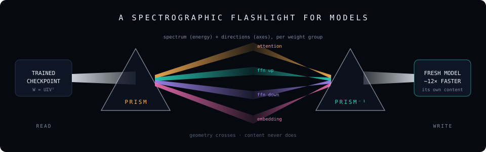
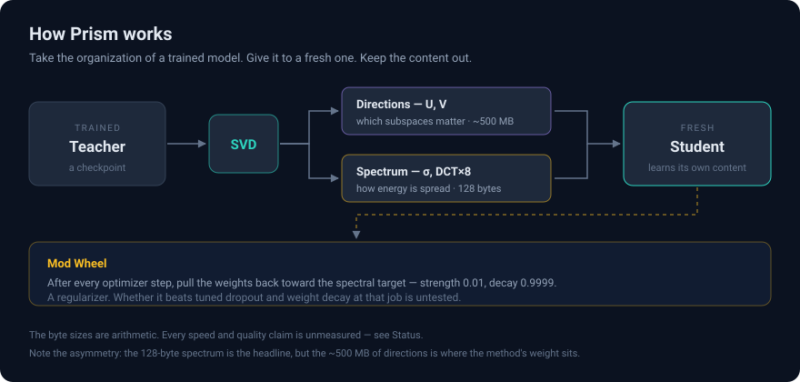
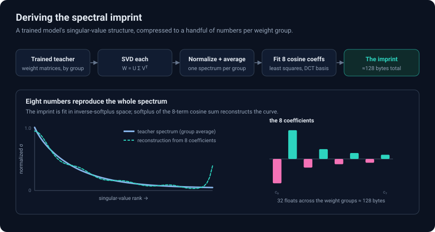
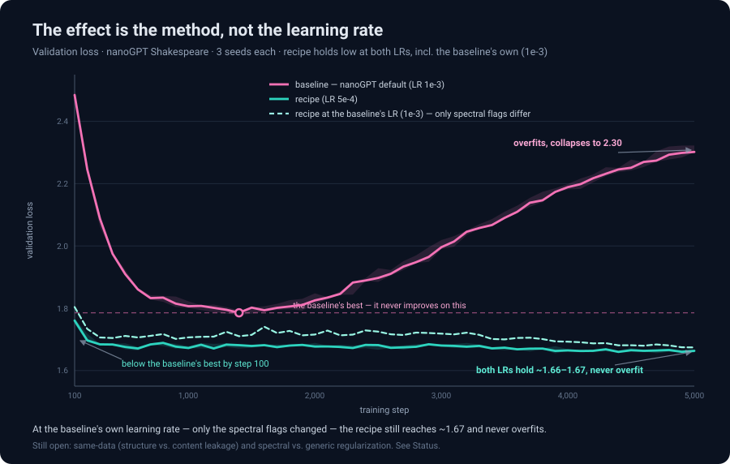

# PRISM

**Take the geometry of a trained neural network — which subspaces it uses, how
its energy is distributed — and hand it to a fresh model at initialization,
then leave it alone. On 2024 web text it reaches the from-scratch baseline's
best quality 3.3× faster and converges below anything the baseline ever
reaches — against a baseline that never overfits. No weights copied, no data
shared. Only geometry.**

PRISM extracts that geometry, transplants it, and measures — one committed
artifact per claim — which parts of it carry the effect. This repo has killed
several of its own hypotheses on the way; what follows is what survived.

*(Formerly `nanogpt-prism-shakespeare`, now archived — full history
[there](https://github.com/timepointai/nanogpt-prism-shakespeare); development
continues here.)*



<a href="https://timepointai.github.io/PRISM/docs/how-prism-works.html"></a>

---

The bench is deliberately small — nanoGPT-class models (10.65M params), three
seeds, one L4, corpora from Shakespeare to a committed slice of 2024 web text —
and every number below has an artifact in [`results/`](results/). The bench is
just the pointing hand: **the claims are about the finger, not what it happens
to be pointing at.**

## What the evidence says

### 1. On modern web text, geometry-at-init beats training from scratch — outright

The flagship, and the hardest test the method has faced: byte-level
**FineWeb-Edu** (2024 CommonCrawl, corpus committed with provenance in
[`data/modernweb/`](data/modernweb/)), a 4.5M-token pool on which the baseline
**never overfits** — no stumble to exploit. Transplant a trained teacher's
directions and spectrum at init, train with *no further intervention*, and the
model:

- reaches the baseline's best quality **3.3× faster** (2.9–3.9×, resolved, 3/3
  seeds),
- **converges 0.11 nats below anything the baseline ever reaches** (1.379 vs
  1.489),
- holds a ~**6×** early-window lead (its step-100 quality takes the baseline
  600–650 steps), starting from a better init (4.4 vs 5.6).

Evidence: [`RESULTS.md`](RESULTS.md) §11, Run R.

### 2. It's the finger, not what it points at

Three escalating experiments were built to kill the "the teacher leaked its
content" explanation. All three failed to kill the effect — it is
**structural, not content**:

- **Same corpus, disjoint data.** Teacher and student get overlapping or
  disjoint halves of 100 random blocks, difficulty-controlled. The early
  advantage is **identical at 100% and 0% overlap** (Δloss 0.57–0.59;
  [`RESULTS.md`](RESULTS.md) §3).
- **Different corpus.** Move the student to Sherlock Holmes and score it on
  held-out *Sherlock*: the advantage *grows* slightly (Δloss 0.591 → 0.627;
  [`RESULTS.md`](RESULTS.md) §4).
- **A teacher that never saw the corpus at all.** Train the teacher exclusively
  on Sherlock, transplant its full geometry into a Shakespeare student: still
  **4.6×** to baseline-best at near-identical final quality — half the speedup
  and ~80% of the quality gain of a same-corpus teacher on the identical rig
  ([`RESULTS.md`](RESULTS.md) §10). Note what this also is: the *directions*
  ported across corpora.

### 3. The active ingredient is the directions — in both directions of use

The decomposition ablations attribute the effect, and the answer is the same
forward and backward:

- **From scratch:** remove the directions and keep everything else
  (spectrum + Mod Wheel) and the model sits **below baseline at every step
  measured** ([`RESULTS.md`](RESULTS.md) §11, Run S). The transplanted
  subspaces are what a fresh model can't cheaply rediscover.
- **In finetuning:** *pinning* the directions — one line, a gentle per-step
  pull toward the pre-finetune weights — cuts catastrophic forgetting **up to
  ~10×** while the model still genuinely learns the new domain,
  Pareto-dominating the low-learning-rate frontier (~2× more retention at
  equal adaptation). Anchoring only the spectrum does nothing (1.07×); a
  wrong-spectrum placebo actively harms (0.39×)
  ([`docs/FINETUNE-RETENTION.md`](docs/FINETUNE-RETENTION.md)).
- **And by construction:** pin the directions hard and new *content cannot be
  written* — novel-fact injection under a retention-grade anchor fails
  outright (2–3% closed-book recall vs 98–100% unanchored) even as the
  anchored model posts the *best* validation loss. Weaken the pull into the
  s≈0.0025 band and injection returns at parity **while still forgetting 3×
  less than plain** — the anchor is a continuous injection↔retention dial
  ([`RESULTS.md`](RESULTS.md) §12, which also shows LM loss is not an
  injection metric, and that facts store in *either* attention or FFNs when
  the other is pinned).
- And the effect tracks exactly what it should: it grows with teacher training
  and **saturates right where the teacher's geometry converges** (≈2,000 steps
  here; 4k/8k teachers add nothing). A barely-trained teacher's geometry is
  noise imprinted with authority — *worse than random init*
  ([`RESULTS.md`](RESULTS.md) §5).

### 4. The Mod Wheel is an overfitting brake — a dial, not a default

The recipe's per-step pull back toward a stored target turns out to be a
**regime tool**, and the two benches price it cleanly:

- **Scarce data (1M-token Shakespeare):** every baseline overfits (1.78 →
  ~2.31 by step 5,000); the wheel-equipped recipe holds ~1.66–1.67 and never
  overfits, reaching baseline-best **11.8×** faster as tuned, **7×** with the
  schedule held identical ([`RESULTS.md`](RESULTS.md) §1–2). The brake is the
  endpoint win.
- **Adequate data (4.5M-token modern web):** nothing to brake — the wheel
  costs the *entire* endpoint lead (init-only 1.379 → recipe 1.491, a tie with
  baseline; [`RESULTS.md`](RESULTS.md) §11).

Practical rule: corpus small enough to overfit → wheel on; otherwise →
init-only.

### 5. The effects compound

- **PRISM-pretrained models are better finetuning substrates.** At *matched*
  quality, a PRISM base finetunes with **≈ zero forgetting** (vs +0.05 nats
  plain) and adapts **~8% better** — and a schedule-matched control pins it on
  the geometry, not the learning rate
  ([`docs/UNIFIED-ARC.md`](docs/UNIFIED-ARC.md)).
- **Geometry stacks with statistics.** Fuse a fixed shared n-gram prior into
  the logits (product of experts) and add PRISM: PRISM alone 15×, n-gram alone
  3.8×, **the hybrid 30× — at the best loss of all four arms**, below even the
  n-gram's own floor. Single-seed probe; the documented path to a literal
  reach-baseline-*at-init* needs a context-4+ sparse prior
  ([`docs/PRIOR-FUSED-PRISM.md`](docs/PRIOR-FUSED-PRISM.md)).

### 6. The spectrum is universal — and honestly priced

The spectrum half of the geometry compresses to **40 numbers** (5 weight
groups × 8 DCT coefficients, ~160 bytes) — and those numbers cross model size,
tokenizer, and corpus *simultaneously*: a fingerprint read off **OpenAI's
public GPT-2 weights** ([`fingerprints/gpt2-124M/`](fingerprints/gpt2-124M/))
performs at parity with a purpose-trained native teacher's on the modern-web
bench (1.747 vs 1.762, GPT-2's marginally better). The other half of the
price tag: in that spectrum-only mode *both* sit below baseline
([`RESULTS.md`](RESULTS.md) §11) — universality is proven, potency is not.
The universal init worth chasing is *directional* (cross-size subspace
projection — see [What's next](#whats-next)).

### The ledger

| study | finding | evidence |
|---|---|---|
| **Modern-web transfer** | geometry-at-init beats a non-overfitting FineWeb-Edu baseline: **3.3×** to its best, **−0.11 nats** beyond it | [`RESULTS.md`](RESULTS.md) §11 |
| **enwik8** | the same effect on the canonical byte-LM bench: **2.90×** to baseline-best, **−0.152 bpb** beyond it, zero-epoch data regime | [`RESULTS.md`](RESULTS.md) §14 |
| **The energy frontier** | every point dominates the baseline: its full quality at **42%** of the GPU time, −0.072 bpb at **56%**, −0.152 bpb at par — and the teacher fingerprint amortizes across corpora (1.97× reused) | [`RESULTS.md`](RESULTS.md) §16 |
| **Cold directions** | never-trained analytic bases refuted (3/3) — geometry is *mined*, not *drawn*; trained checkpoints are the commons | [`RESULTS.md`](RESULTS.md) §15 |
| **From-scratch transfer (scarce data)** | **11.8×** tuned / **7×** schedule-matched to baseline-best; no overfitting where every baseline overfits | [`RESULTS.md`](RESULTS.md) §1–2 |
| **Structure, not content** | advantage identical at 100% and 0% data overlap; grows on a different corpus | [`RESULTS.md`](RESULTS.md) §3–4 |
| **Teacher-free init** | a teacher that **never saw the target corpus** keeps **4.6×** of 9.9× and ~80% of the quality gain | [`RESULTS.md`](RESULTS.md) §10 |
| **Attribution: directions** | spectrum-only below baseline everywhere from scratch; directional anchor is what retains (~**10×** less forgetting) | [`RESULTS.md`](RESULTS.md) §11, [`docs/FINETUNE-RETENTION.md`](docs/FINETUNE-RETENTION.md) |
| **Attribution: the wheel** | an overfitting brake — endpoint-decisive on scarce data, a cost on adequate data | [`RESULTS.md`](RESULTS.md) §2, §11 |
| **The arc** | PRISM-pretrained base: **≈0 forgetting, ~8% better adaptation** at matched quality | [`docs/UNIFIED-ARC.md`](docs/UNIFIED-ARC.md) |
| **Fact injection** | the anchor is an injection↔retention **dial**: retention-grade strength blocks storage (2–3% recall); the weak band (s≈0.0025) injects at parity with plain while forgetting **3× less** (2× less than low-LR); LM loss can't see any of it | [`RESULTS.md`](RESULTS.md) §12 |
| **Task specialization** | on a scored catalog-review workflow, the weak-band anchor **Pareto-dominates low-LR**: 97% on novel cases (≈plain's 98%) at **3× less** general-ability loss — the axis specialization pipelines don't report | [`RESULTS.md`](RESULTS.md) §13 |
| **Prior-Fused PRISM** | geometry × statistics: **30×** hybrid at the best loss of all arms (single-seed probe) | [`docs/PRIOR-FUSED-PRISM.md`](docs/PRIOR-FUSED-PRISM.md) |
| **Spectrum universality** | GPT-2's 40 public-weight numbers ≈ a native teacher's spectrum across size, tokenizer, and corpus | [`RESULTS.md`](RESULTS.md) §11 |

Every number has a matching committed `results/*.json` (loss curves,
provenance, git commit, argv, censoring flags). A claim without an artifact is
not a result in this repo.


## How it works

Every weight matrix of a trained model factors as `W = U Σ Vᵀ`: the
**directions** (U, V — which subspaces the model decided were worth using) and
the **spectrum** (Σ — how much energy it put in each). Together they describe
the model's *organization* without describing anything it *knows*. PRISM is
three operations on that geometry, with roles the ablations have now priced:

1. **EigenTransfer** — blend the fresh model's singular vectors 75% toward the
   teacher's, then re-orthogonalize. *The active ingredient.*
2. **Spectral Imprint** — compress the teacher's singular-value distribution to
   8 DCT coefficients per weight group (**40 numbers, ~160 bytes**) and reshape
   the fresh model's spectrum to match at init. *Universal across models and
   corpora; supporting role.*
3. **Mod Wheel** — after every optimizer step, pull the weights gently back
   toward a stored target: `W ← (1−s)·W + s·W_target`. *An overfitting brake
   (forward) and the retention anchor (backward).*

No parameters are copied. The student learns its own content from scratch — it
just doesn't spend its first thousand steps rediscovering *which subspaces a
trained transformer uses*.





The same parts run in two directions:

- **Forward (transfer):** inject the geometry at init. Directions do the
  lifting; the spectrum is the cheap universal part; add the wheel only when
  the corpus is small enough to overfit.
- **Backward (retain):** the wheel again, anchored to the model's **own**
  pre-finetune weights — pinning the directions is what prevents forgetting:

```
W  ←  (1 − s)·W  +  s·W₀        # after each step; W₀ = pre-finetune weights; s ≈ 0.01–0.02
```

Gradient descent still dominates each step, so the model keeps learning the
new domain — it just never drifts far from what it already knew. `s` is the
retention/plasticity dial.



## Use it

Two entry points — one per direction. **Transfer** into a fresh model:

```bash
cd src
python prism_accelerate.py \
    --teacher_ckpt path/to/trained/ckpt.pt \
    --out_dir out-accelerated \
    -- --max_iters=2000 --dataset=your_dataset
```

What the measurements say you should know:

- **Match the Mod Wheel to your data regime.** Corpus small enough to overfit →
  keep the recipe as-is. Adequate data → append `-- --prism_mod=0.0`: the
  init-only configuration is what beat the modern-web baseline outright.
- **The teacher must be trained.** A weak teacher is *worse than random init*;
  the advantage saturates once the teacher converges — train to convergence,
  no further.
- Teacher and student must share the same architecture — directional transfer
  is dimension-specific. Cross-size projection is the open frontier.

**Finetune** a trained model without forgetting:

```bash
cd src
python prism_finetune.py \
    --base_ckpt path/to/trained/ckpt.pt \
    --new_data your_new_dataset --retain_val your_old_dataset \
    --out_dir out-finetuned --mod 0.01 --ft_steps 1000
# add --plain to run the same finetune with the anchor off, for comparison
```

`--mod` is the retention/plasticity dial; `--retain_val` scores the old domain
alongside the new so you can see the forgetting the anchor prevents.

## Start here (humans and agents)

```bash
git clone https://github.com/timepointai/PRISM.git
cd PRISM/src
pip install torch numpy transformers tiktoken datasets
python prism_selftest.py          # 30 offline invariant tests, CPU, ~1 min — start here
python prism_eval.py --teacher_steps=10 --student_steps=10 --eval_every=5 \
  --eval_iters=2 --seeds=1337 --batch_size=4     # tiny end-to-end smoke, CPU, ~1 min
```

Ground rules the tooling enforces, worth knowing before you run anything real:

1. **Evidence = `results/*.json`.** Every run writes a full artifact. A claim
   without a committed artifact is not a result.
2. **Reading a score:** `prism_score` is a ratio — always read it against
   `baseline_best` (a weak baseline inflates it). `left_censored: true` is a
   floor, not a measurement. `schedule_matched: true` means only the PRISM
   flags differed — the attribution-grade comparison.
3. **Runs are resumable:** stages bank to `.prism_runs/<run-key>/`; the same
   command resumes, any changed knob gets a fresh key. Partial or crashed runs
   raise — they are never scored.
4. **Probes must keep `warmup ≪ student_steps`**, or the warmup flattens both
   arms and voids the comparison.
5. **One variable at a time.** Every knob (`--align_mode`, `--cross_teacher`,
   `--corpus`, `--fingerprint`, …) folds into the run key; test each against
   the plain configuration on an otherwise-identical rig, never stacked.

A machine-readable summary of the method and measurements is embedded at the
bottom of the [visual explainer](https://timepointai.github.io/PRISM/docs/how-prism-works.html) —
a standalone, self-contained page served from GitHub Pages; source:
[`docs/how-prism-works.html`](docs/how-prism-works.html).

## Honest bounds on the claims

- **Scale.** 10.65M params, corpora of 1M–4.5M tokens. Nothing here has met a
  production model. The GPT-2 extraction crosses into a 124M model for the
  spectrum only.
- **The modern-web decomposition is a probe at one horizon** (1,500 steps, one
  corpus). The wheel's decay schedule was tuned on Shakespeare and never
  retuned — at step 1,500 it still pulls at ~86% strength, so a faster decay
  might rescue the full recipe there (untested). The mirror cell — init-only
  on Shakespeare — hasn't run, so "the brake wins on scarce data" is inferred
  from the recipe runs, not yet isolated.
- **Init-only has not been compared against other structured inits**
  (orthogonal, spectrally-scaled random, μP-style). The teacher-strength
  dependence argues the *trained* geometry is what matters — a weak teacher's
  geometry actively hurts — but a direct init-comparison arm hasn't run.
- **The 30× is a single-seed probe** measuring the compounding of two free
  priors; the defensible claim is the hybrid beats PRISM alone at the best
  loss, not that PRISM alone is 30×.
- **"Different corpus" tops out at Sherlock and 2024 web English.** A genuinely
  different modality (code, another language) is untested — though the
  byte-level bench now makes it runnable.
- **Teacher-free init is measured at one distance, in one direction**, with a
  ~40% smaller teacher corpus as a known confound.
- **Finetune-retention shows old-domain retention**, not new-domain overfit
  prevention, and trades a little late adaptation for it.

## Reproduce it

**The modern-web decomposition (Modal, headless, isolated volume per arm):**

```bash
pip install modal && modal setup                            # one-time auth
modal run --detach prism_modal_modernweb.py --arm dirs      # the winner: init-only
modal run --detach prism_modal_modernweb.py --arm recipe    # + mod wheel
modal run --detach prism_modal_modernweb.py --arm spec      # spectrum-only ablation
modal run --detach prism_modal_modernweb.py --arm gpt2      # GPT-2's 40 numbers, no teacher
```

**The scarce-data (Shakespeare) results:**

```bash
modal run --detach prism_modal.py \
  --extra "--student_steps=1500 --eval_every=10 --eval_iters=50"   # the 11.8× run
modal run --detach prism_modal.py \
  --extra "--method_lr=1e-3 --method_warmup=100"        # the matched-LR control (7×)
```

**The transfer probes (local or Modal):**

```bash
cd src
python prism_eval.py --teacher_steps=500 --student_steps=100 --eval_every=10 \
  --eval_iters=40 --batch_size=32 --method_lr=1e-3 --method_warmup=20 \
  --baseline_warmup=20 --overlap=1.0,0.75,0.5,0.25,0.0        # overlap sweep
python prism_eval.py --teacher_sweep=100,250,500,1000,2000 \
  --student_steps=300 --eval_every=20 --eval_iters=40 --batch_size=32   # teacher lever
python prism_eval.py --report                                  # reprint last artifact
```

The cross-domain arm adds `--far_corpus=data/far.txt --far_val`; the
teacher-free pair is `prism_modal_teacherfree.py --arm cross|control`. The
finetune-retention, arc, and prior-fusion benchmarks run on their own isolated
volumes — `prism_modal_finetune.py`, `prism_modal_arc.py`,
`prism_modal_prior.py` (commands in [`RESULTS.md`](RESULTS.md) and the docs).

## What's next

The ranked, run-command-ready list lives in
[`docs/NEXT-EXPERIMENTS.md`](docs/NEXT-EXPERIMENTS.md). Highlights:

1. **Complete the Mod Wheel 2×2** — init-only on Shakespeare (does the brake
   still win where the baseline overfits?) and a decay retune on modern text.
2. **Cross-size directional projection** — with the spectrum priced as
   universal-but-weak, the universal init worth building is directional:
   project GPT-2's subspaces down to a small model. The most differentiated
   payoff on the board.
3. **The reach-at-init moonshot** — the Prior-Fused hybrid reaches baseline
   quality *at init* if the shared prior sits clearly below baseline; needs a
   context-4+ sparse n-gram. The path from the 30× hybrid toward a literal
   1000×.
4. **A truly far modality — now unblocked**: the byte-level vocab covers source
   code and other languages; point `--corpus` at one and find where structural
   transfer degrades.
5. **Close the teacher-free gap** — teacher-corpus-size control, a second far
   corpus for score-vs-distance, averaged multi-corpus (Σ\*) fingerprints;
   plus long-horizon far-domain, continual A→B→C, and the "unfold curve".

## Repo map

```
README.md                     ← you are here
docs/how-prism-works.html     ← the visual explainer (standalone, self-contained)
docs/FINETUNE-RETENTION.md    ← finetune without forgetting — study + frontier
docs/UNIFIED-ARC.md           ← PRISM pretraining + finetuning compound — the arc
docs/PRIOR-FUSED-PRISM.md     ← T9 × PRISM — the n-gram prior compounds (30×)
docs/NEXT-EXPERIMENTS.md      ← the ranked next experiments + run commands
WHITEPAPER.md                 ← method + experiments in full
RESULTS.md                    ← the committed runs and what they do / don't show
results/                      ← eval artifacts. the evidence.
archive/                      ← v0.0 / v0.1 writeups + retired notebooks
prism_modal.py                ← headless Modal runner (the committed from-scratch runs)
prism_modal_finetune.py       ← isolated runner — finetune-retention benchmark
prism_modal_arc.py            ← isolated runner — the arc benchmark
prism_modal_prior.py          ← isolated runner — Prior-Fused (T9 × PRISM) benchmark
prism_modal_teacherfree.py    ← isolated runner — the teacher-free init probe
prism_modal_modernweb.py      ← isolated runner — the modern-web decomposition (4 arms)
prism_modal_leo.py            ← isolated runner — geometric-lever experiments
unfold_curve.py               ← exploratory: the Σ*/"unfold curve" first cut
src/prism_eval.py             ← the from-scratch benchmark (all transfer knobs)
src/prism_finetune_eval.py    ← the finetune-retention benchmark
src/prism_arc_eval.py         ← the arc benchmark (matched-quality bases)
src/prism_prior_eval.py       ← the Prior-Fused benchmark (4 arms)
src/build_ngram_prior.py      ← builds the shared n-gram prior ("the T9 dictionary")
src/prism_accelerate.py       ← apply PRISM to any checkpoint (transfer entry point)
src/prism_finetune.py         ← finetune any checkpoint without forgetting
src/prism_init.py             ← EigenTransfer + Spectral Imprint + Mod Wheel
src/prism_extract.py          ← extract a fingerprint from any checkpoint (or --hf gpt2)
src/prism_selftest.py         ← 30 offline invariant tests — run before any GPU spend
data/far.txt                  ← Sherlock Holmes (Project Gutenberg #1661) — the far corpus
data/modernweb/               ← FineWeb-Edu slice (2024 web text, byte-level) — the modern bench
fingerprints/gpt2-124M/       ← 40 numbers read off OpenAI's public GPT-2 weights
```

## License

MIT — see [LICENSE](LICENSE).

A standalone clone of [nanoGPT](https://github.com/karpathy/nanoGPT) by Andrej
Karpathy (MIT, © 2022), not a fork. `model.py`, `configurator.py`, `bench.py`,
`sample.py`, and the `data/` preparers are his; `train.py` is his with PRISM
hooks added (all off by default — a scratch run is byte-identical to nanoGPT).
The PRISM code (`prism_*.py`, `build_ngram_prior.py`, `config/prism_*.py`) is
Timepoint Labs', under the same terms.

---

*A [Timepoint Labs](https://timepointai.com) project by [Sean McDonald](https://x.com/seanmcdonaldxyz).*
